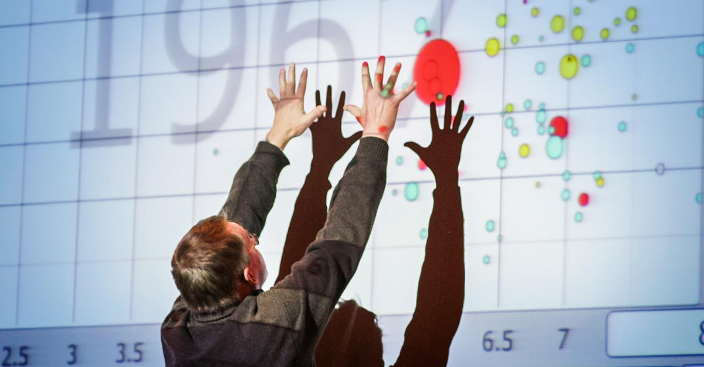
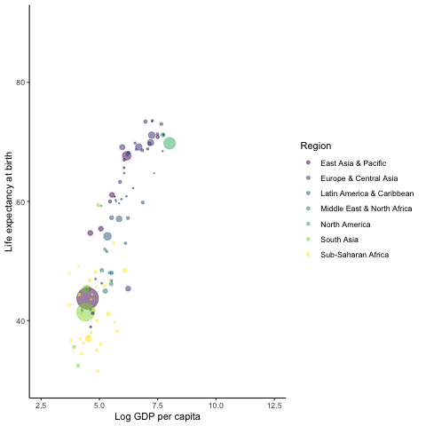

background-image: url("assets/img/cv.png")
background-size: contain

# Minha Trajetória

.footnote[
[Curriculum vitæ](https://github.com/fjuniorr/Awesome-CV/blob/master/cv_pt.pdf)
]

---
exclude: true

# Sobre Rótulos

> Cientista de Dados (def.): Pessoa que é melhor em estatística do que qualquer engenheiro de software e melhor em engenharia de software do que qualquer estatístico.

-- Josh Wills, no [Twitter](https://twitter.com/josh_wills/status/198093512149958656)


```{r, echo=FALSE, out.width='40%'}
knitr::include_graphics("https://images.squarespace-cdn.com/content/v1/5150aec6e4b0e340ec52710a/1364352051365-HZAS3CLBF7ABLE3F5OBY/ke17ZwdGBToddI8pDm48kB2M2-8_3EzuSSXvzQBRsa1Zw-zPPgdn4jUwVcJE1ZvWQUxwkmyExglNqGp0IvTJZUJFbgE-7XRK3dMEBRBhUpxPe_8B-x4gq2tfVez1FwLYYZXud0o-3jV-FAs7tmkMHY-a7GzQZKbHRGZboWC-fOc/Data_Science_VD.png?format=1500w")
```

-- Drew Conway, [Diagrama de Veen da Ciência de Dados](http://drewconway.com/zia/2013/3/26/the-data-science-venn-diagram)

???

Se eu tivesse que colocar um rótulo pra perspectiva que eu vou abordar o conteúdo dessa disciplina seria o de um cientista de dados.

Eu vou usar análise de dados e ciência de dados como sinônimos, apesar de que existe muita discussão conceitual sobre as distinções mas que pro nosso objetivo não são necessárias.

---
class: inverse

# Atividade

Faça uma breve apresentação de você (ie. nome e CSAP), abordando, por exemplo:

* Objetivo ao cursar essa disciplina;
* Experiência prévia com análise de dados e R;
* Histórico profissional (eg. estágio);
* Histórico acadêmico (eg. outros cursos).

---
# Motivação

> I keep saying the sexy job in the next ten years will be statisticians. People think I’m joking, but who would’ve guessed that computer engineers would’ve been the sexy job of the 1990s? 
> 
> The ability to take data — to be able to understand it, to process it, to extract value from it, to visualize it, to communicate it — that’s going to be a hugely important skill in the next decades, not only at the professional level but even at the educational level for elementary school kids, for high school kids, for college kids. 
> 
> Because now we really do have essentially free and ubiquitous data. So the complimentary scarce factor is the ability to understand that data and extract value from it.

-- Hal Varian, [The McKinsey Quarterly](https://www.mckinsey.com/industries/technology-media-and-telecommunications/our-insights/hal-varian-on-how-the-web-challenges-managers), Janeiro 2009

---
# Motivação (2)

```{r, echo=FALSE}

```

-- Hans Rosling, [The best stats you've ever seen TED Talk](https://www.ted.com/talks/hans_rosling_shows_the_best_stats_you_ve_ever_seen?referrer=playlist-the_best_hans_rosling_talks_yo), 2006

---
# Motivação (2)

.center[
<iframe width="560" height="315" src="https://www.youtube.com/embed/hVimVzgtD6w?start=720" frameborder="0" allow="accelerometer; autoplay; encrypted-media; gyroscope; picture-in-picture" allowfullscreen>
</iframe>
]


---
# Motivação (2)

.pull-left[
```{r, echo=FALSE}
knitr::include_graphics("assets/img/hans_rosling_code.svg")
```
]

.pull-right[
```{r, echo=FALSE}

```
]

-- Keith McNulty (@dr_keithmcnulty), [Twitter](https://twitter.com/dr_keithmcnulty/status/1187149459588812800?s=20)
---
# Objetivo geral

O objetivo desta disciplina é apresentar ao aluno a utilização do ambiente computacional R para manipulação e visualização de dados, com foco em dados tabulares, utilizando práticas de pesquisa reproduzível. 

O enfoque não é a utilização do R para fins de modelagem estatística, no entanto, conceitos básicos como estatísticas descritivas e distribuições de probabilidade serão utilizados para análise e interpretação de bases de dados reais. 

Essa disciplina não assume conhecimento prévio em programação. 

Ao final, espera-se que o aluno tenha desenvolvido habilidades computacionais úteis para análise de dados.

---
# Objetivo geral

O objetivo desta disciplina é apresentar ao aluno a utilização do ambiente computacional R para __manipulação e visualização de dados__, 
--
com foco em __dados tabulares__, 
--
utilizando __práticas de pesquisa reproduzível__. 
--


O enfoque não é a utilização do R para fins de __modelagem estatística__, 
--
no entanto, __conceitos básicos__ como estatísticas descritivas e distribuições de probabilidade serão utilizados 
--
para análise e interpretação de __bases de dados reais__. 
--


Essa disciplina não assume __conhecimento prévio em programação__. 

--

Ao final, espera-se que o aluno tenha desenvolvido __habilidades computacionais__ úteis para análise de dados.

---
# Conteúdo Programático

* __Processo de análise de dados__
  * Introdução. Coleta, importação, tratamento e limpeza, transformação, visualização, modelagem, e comunicação de dados.
* __Pesquisa reproduzível__
  * Introdução ao R e ao RStudio. Controle de versão com git e colaboração com GitHub. Relatórios dinâmicos. Uso do pacote rmarkdown. Organização de projetos de análise de dados.
* __Introdução à programação__
  * A linguagem de programação R: comandos básicos, estruturas de dados.
* __Manipulação de dados__
  * Dados estruturados: dados tabulares; dados relacionais; _tidy data_. Limpeza e transformação de dados. Operador `%>%` (pipe). Uso do pacote _tidyr_. Uso do pacote _dplyr_.
* __Visualização de dados__
  * Gramática dos gráficos. Gráficos em camadas. Principais tipos de visualizações. Uso do pacote ggplot2.
* __Introdução à programação funcional__
  * Funções e programação funcional. Uso do pacote _purrr_.

---
# Avaliação

1. Reprodução de uma visualização de dados utilizando o ggplot2 (30 pts)

2. Criação de análise exploratória de uma base de dados como um documento dinâmico (30 pts)

3. Revisão por pares de 1 e 2 (10 pts)

4. Exercícios práticos em sala de aula (30 pts)

---
# Bibliografia

Wickham, Hadley, and Garrett Grolemund. 2017. [R for Data Science](https://www.amazon.com.br/R-Data-Science-Garrett-Wickham/dp/1491910399/ref=sr_1_2?adgrpid=83848702769&gclid=EAIaIQobChMIhfKslpWB6AIViQiRCh002gCcEAAYAiAAEgJbMvD_BwE&hvadid=392903686222&hvdev=c&hvlocphy=1001566&hvnetw=g&hvqmt=e&hvrand=2087831905919145185&hvtargid=kwd-297562728697&hydadcr=5628_10696897&keywords=r+for+data+science&qid=1583336792&sr=8-2): Import, Tidy, Transform, Visualize, and Model Data. 1 edition. Sebastopol, CA: O’Reilly Media. Disponível em: <https://r4ds.had.co.nz/>.

---
class: inverse

# Atividade

Caso você ainda não possua, [crie uma conta no google](https://support.google.com/mail/answer/56256?hl=pt-BR).

Preencha o formulário (link será disponibilizado em sala) com 

* nome completo;
* CSAP (eg. 41);
* email.

Além disso, preencha o questionário sobre as suas experiências e habilidades prévias que são úteis para análise de dados.

Isso vai auxiliar na estratégia de apresentação do conteúdo do curso.

`r countdown::countdown(minutes = 3)`

---
class: inverse

# Atividade - Próxima Aula

Escolha sua dupla para utilização dos computadores e para as atividades em sala e preencha esse formulário.

A dupla será a mesma até o fim do semestre e será utilizada para formação dos grupos.