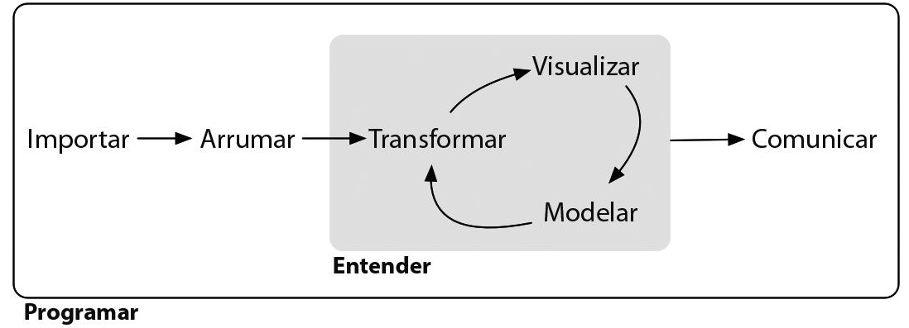

class: hide-logo

# Fluxo de Análise de Dados

```{r echo=FALSE}

```

.footnote[
H. Wickham (Aut), G. Grolemund (Aut), S. Batista (Tra), [R Para Data Science](https://www.amazon.com.br/Para-Data-Science-Hadley-Wickham/dp/8550803243/)
]

---
class: hide-logo
# Estudo de base

### Remuneração dos servidores públicos ativos do Poder Executivo Estadual

Divulgação dos dados de pessoal do Poder Executivo do Estado de Minas Gerais, conforme previsto no Decreto Estadual nº 45.969/2012 e Resolução Conjunta SEPLAG/CGE nº 8676, de 30 de julho de 2012.

> Sua remuneração bruta, cargos e funções por eles titularizados, órgãos de sua formal lotação, tudo é constitutivo de informação de interesse coletivo ou geral. Expondo-se, portanto, a divulgação oficial. [...] Não cabe, no caso, falar de intimidade ou de vida privada, pois os dados objeto da divulgação em causa dizem respeito a agentes públicos enquanto agentes públicos mesmos; ou, na linguagem da própria Constituição, agentes estatais agindo “nessa qualidade”. [STF - RECURSO EXTRAORDINÁRIO 652.777-SP](http://redir.stf.jus.br/paginadorpub/paginador.jsp?docTP=TP&docID=8831570)

* [Consulta interativa](http://www.transparencia.mg.gov.br/estado-pessoal/remuneracao-dos-servidores)
* [Dados abertos](http://www.transparencia.dadosabertos.mg.gov.br/dataset/remuneracao-dos-servidores)
* [Dicionário de dados](http://www.transparencia.dadosabertos.mg.gov.br/dataset/remuneracao-dos-servidores/resource/ab5a9b7b-4af3-4720-8029-8f96d7517d17)

---
# Importar

* Carregamento dos dados do local em que eles se encontram armazenados e carregamento em um software 
  * Ex1: Duplo clique em uma planilha eletrônica
  * Ex2: Requisição HTTP para uma API RESTful


* E se os dados não existem? 
  * [Planejamento de pesquisa & coleta de dados](http://www.creative-wisdom.com/teaching/WBI/dma.shtml)
  
---
# Arrumar

* Estruturação dos dados de tal forma que a análise exploratória seja tão simples quanto possível

* Linhas representem observações e as colunas representem variáveis

* Limpeza de dados também ocorre nessa etapa

* Usualmente o significado dos dados não vai mudar

--

<br>

Caso concreto:

<br>

| Ano  | Masp | Órgão                        | jan   | fev   |
| ---- | ---- | ---------------------------- | ----- | ----- |
| 2019 | m123 | SECRETARIA DE PLANEJAMENTO   | 6000  | 4500  |
| 2019 | m456 | SEC DE PLANEJAMENTO E GESTAO | 13300 | 10000 |

---
# Arrumar

#### Tabela original (1)

| Ano  | Masp | Órgão                        | jan   | fev   |
| ---- | ---- | ---------------------------- | ----- | ----- |
| 2019 | m123 | SECRETARIA DE PLANEJAMENTO   | 6000  | 4500  |
| 2019 | m456 | SEC DE PLANEJAMENTO E GESTAO | 13300 | 10000 | 

#### Tabela arrumada (2)

| Ano  | Masp | Órgão                        | Mês | Remuneração | 
| ---- | ---- | ---------------------------- | --- | ----------- |
| 2019 | m123 | SECRETARIA DE PLANEJAMENTO   | jan | 6000        |
| 2019 | m123 | SECRETARIA DE PLANEJAMENTO   | fev | 4500        |
| 2019 | m456 | SEC DE PLANEJAMENTO E GESTAO | jan | 13300       |
| 2019 | m456 | SEC DE PLANEJAMENTO E GESTAO | fev | 10000       |

---
# Arrumar

#### Tabela arrumada (2)

| Ano  | Masp | Órgão                        | Mês | Remuneração | 
| ---- | ---- | ---------------------------- | --- | ----------- |
| 2019 | m123 | SECRETARIA DE PLANEJAMENTO   | jan | 6000        |
| 2019 | m123 | SECRETARIA DE PLANEJAMENTO   | fev | 4500        |
| 2019 | m456 | SEC DE PLANEJAMENTO E GESTAO | jan | 13300       |
| 2019 | m456 | SEC DE PLANEJAMENTO E GESTAO | fev | 10000       |

#### Tabela limpa (3)

| Ano  | Masp | Órgão  | Mês | Remuneração |
| ---- | ---- | ------ | --- | ----------- |
| 2019 | m123 | SEPLAG | jan | 6000        |
| 2019 | m123 | SEPLAG | fev | 4500        |
| 2019 | m456 | SEPLAG | jan | 13300       |
| 2019 | m456 | SEPLAG | fev | 10000       |

---
# Transformar

* Transformações são todas as outras manipulações de dados que não se enquadram como arrumação e limpeza &#x1F61C;

* Os principais exemplos são:
  * Filtrar observações de interesse
  
  * Ordenar as observações com base em uma ou mais variáveis
  
  * Selecionar variáveis especificas para fins de análise
  
  * Criar novas variáveis com base nas existentes
  
  * Sumarizar uma variável (qualitativa ou quantitativa) de interesse

---
# Visualizar

* Seja com os dados primários, transformados, ou sumarizados pra facilitar o entendimento vamos criar visualizações

* O objetivo é utilizar a capacidade humana de percepção visual pra extrair informações dos dados

---
class: inverse, hide-logo

# Atividade

Para ilustrar a capacidade de uma visualização de dados potencializar a apropriação de informação vamos fazer um breve quiz.

O objetivo é analisar dados tabulares e estatísticas descritivas para identificar padrões de comportamento nos dados.

O link para o quiz será disponibilizado em sala de aula.

`r countdown::countdown(minutes = 5)`