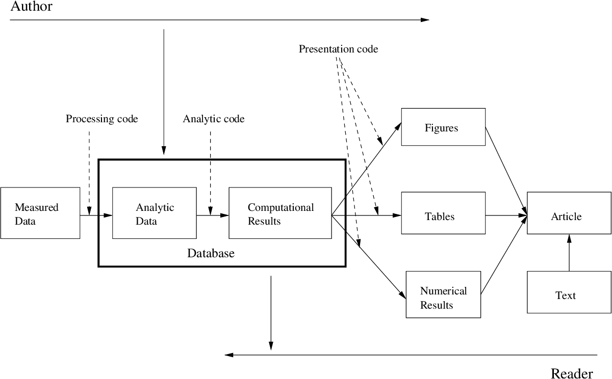
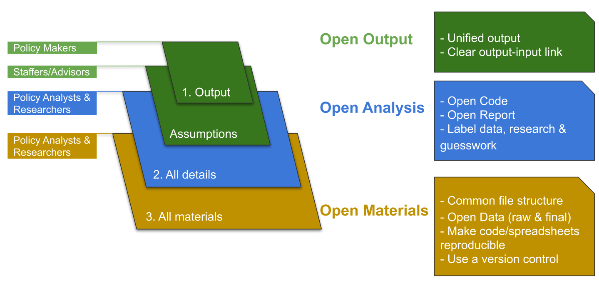
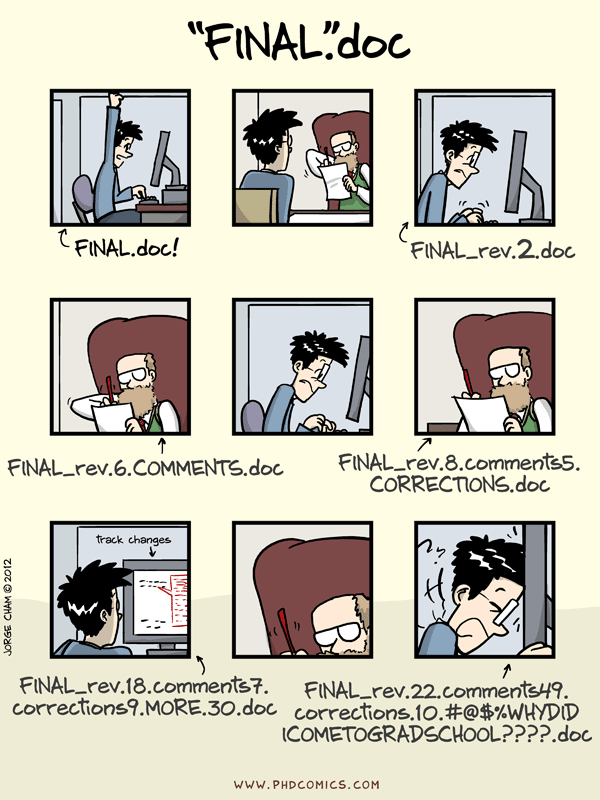

```{r setup, include=FALSE}
knitr::opts_chunk$set(echo = FALSE)
```

# Fluxo de Análise de Dados - Artefatos

```{r, out.width='90%'}

```

.footnote[
-- Roger D. Peng, [Report Writing for Data Science in R](https://leanpub.com/reportwriting), pg. 9
]

---
# Pesquisa reproduzível

> Um artigo sobre ciência computacional em uma revista científica não é conhecimento, é apenas propaganda do conhecimento. O conhecimento verdadeiro é o ambiente de desenvolvimento e o conjunto completo de instruções que geraram os resultados. (tradução nossa)

.footnote[
-- J. B. Buckheit and D. L. Donoho, [ WaveLab and Reproducible Research](https://statweb.stanford.edu/~wavelab/Wavelab_850/wavelab.pdf), pg. 5
]

---
# Replicabilidade *versus* Reprodutibilidade

- Replicabilidade (Replicável): Mesmas descobertas científicas utilizando investigadores, métodos, dados, equipamentos e protocolos independentes

- Reprodutibilidade (Reprodutível): Mesmas descobertas científicas utilizando investigadores independentes porém os mesmos métodos, dados, equipamentos e protocolos

---
# Open Policy Analysis (OPA)

> A Open Policy Analysis (OPA) é uma abordagem para condução de análise de políticas públicas que envolve disponibilizar dados, códigos, materiais e documentação das decisões metodológicas de forma livre para facilitar a colaboração, discussão e reutilização. A OPA adapta e aplica ferramentas, métodos e práticas simples e versáteis, comumente usadas para transparência e reprodutibilidade em pesquisas científicas. (tradução nossa)

.footnote[
-- Berkeley Initiative for Transparency in the Social Sciences, [Guidelines for OPA](https://www.bitss.org/wp-content/uploads/2019/03/OPA-Guidelines.pdf)
]

---
# Open Policy Analysis (OPA)

.center[
```{r}

```
]

.footnote[
-- [Berkeley Initiative for Transparency in the Social Sciences](https://www.bitss.org/opa/)
]

---
# OPA - Estudo de Caso - Despesa de pessoal

.small[
> __[Lei de Responsabilidade Fiscal (LRF)](http://www.planalto.gov.br/ccivil_03/leis/lcp/lcp101.htm#art16)__
> 
> Art. 16. A criação, expansão ou aperfeiçoamento de ação governamental que acarrete aumento da despesa será acompanhado de:
> 
> I - estimativa do impacto orçamentário-financeiro no exercício em que deva entrar em vigor e nos dois subseqüentes;
> 
> [...]
> 
> § 2º A estimativa de que trata o inciso I do caput será acompanhada das premissas e metodologia de cálculo utilizadas.
> 
> [...]
> 
> Art. 17. Considera-se obrigatória de caráter continuado a despesa corrente derivada de lei, medida provisória ou ato administrativo normativo que fixem para o ente a obrigação legal de sua execução por um período superior a dois exercícios.
> 
> § 1º Os atos que criarem ou aumentarem despesa de que trata o caput deverão ser instruídos com a estimativa prevista no inciso I do art. 16 e demonstrar a origem dos recursos para seu custeio.
> 
> [...]
> 
> § 6º O disposto no § 1º não se aplica às despesas destinadas ao serviço da dívida nem ao reajustamento de remuneração de pessoal de que trata o inciso X do art. 37 da Constituição.
]

---
# OPA - Estudo de Caso - Despesa de pessoal

> [...] a Secretaria de Estado de Planejamento e Gestão – Seplag – enviou a esta Casa ofício informando que o impacto orçamentário-financeiro decorrente da implementação da proposta será de R$ 1,1 bilhão para o exercício de 2020, de R$ 2,85 bilhões para o exercício de 2021 e de R$ 5,06 bilhões para o exercício de 2022.

.footnote[
-- Comissão de Fiscalização Financeira e Orçamentária (CFFO/ALMG), [Parecer 1º Turno PL Nº 1.451/2020](https://www.almg.gov.br/atividade_parlamentar/tramitacao_projetos/documento.html?a=2020&n=1451&tipoProjeto=PROJETO%20DE%20LEI&s=PL&link=%2Fproposicoes%2Fpesquisa%2Favancada%3Fexpr%3D%28PL.2020014510410%5Bcodi%5D%29%5Btxmt%5D%26pesqProp%3Dtrue)
]

---
# OPA - Estudo de Caso - Previdência

```{r}

```

.footnote[
-- [Folha de São Paulo](https://www1.folha.uol.com.br/mercado/2019/04/governo-decreta-sigilo-sobre-estudos-que-embasam-reforma-da-previdencia.shtml)]

---
# Ferramentas

Nessa disciplina as principais ferramentas que vamos utilizar são:

* [git](https://git-scm.com/) (2005)
* [GitHub](https://github.com/)<sup>1</sup> (2007)
* [markdown](https://daringfireball.net/projects/markdown/) (2004)
* [R](https://www.r-project.org/) (1993)
* [Rstudio](https://rstudio.com/products/rstudio/)<sup>2</sup> (2011)
* [Make](https://www.gnu.org/software/make/)<sup>*</sup> (1976)

.footnote[
[1] Desenvolvedor: 
* GitHub, Inc. - 2008 até 2018
* Microsoft Corporation - 2018 em diante

[2] Desenvolvedor: 
* RStudio, Inc. - 2009 até 2020
* RStudio, PBC - 2020 em diante
]

---
class: inverse, middle, center

# Controle de versão

---
.center[
```{r echo=FALSE, out.width='60%'}

```
]

---
# Modelo mental

* Sistema de arquivos é bidimensional:
  * pasta ou diretório
  * arquivo

* Sistema de controle de versão é tridimensional:
  * pasta ou diretório
  * arquivo
  * tempo

---
# Benefícios técnicos

* Agrupar um conjunto de alterações logicamente relacionadas

* Registrar indefinidamente o histórico de alterações com informações sobre:
  * Autoria da alteração;
  * Motivo alteração;
  * Conteúdo da alteração.

---
# Benefícios sociotécnicos

### Processo de comunicação

> Text is explicit. By forcing communication through a textual medium, you’re forcing people to better formulate their ideas.

-- Zach Holman, [Chat Trumps Meetings](https://zachholman.com/posts/chat/)

### Processo de colaboração
  
> Because the core operation in GitHub is ‘diff’ — what are the differences between two pieces of text — it elevates “Show me” as a social norm. Expressing, clearly and comparably, where you think a particular piece of text could or should be changed for the better becomes a core operation.

-- Clay Shirky, [How the Internet will (one day) transform government](http://blog.ted.com/further-reading-in-github/)

---
# Controle de versão - Ferramentas

```{r echo=FALSE, out.width='20%'}
knitr::include_graphics("https://git-scm.com/images/logos/downloads/Git-Logo-2Color.png")
```


A Wikipedia [define](https://en.wikipedia.org/wiki/Git) git como

> Git é um sistema de controle de versões distribuído utilizado para registrar o histórico de alterações no código fonte de um programa durante o desenvolvimento de software. (tradução nossa)


Já o GitHub é [definido](https://pt.wikipedia.org/wiki/GitHub) como

> GitHub é uma plataforma de hospedagem de código-fonte com controle de versão usando o Git. [...] além de promover fácil comunicação através de recursos que relatam problemas ou mesclam repositórios remotos (issues, pull request).


