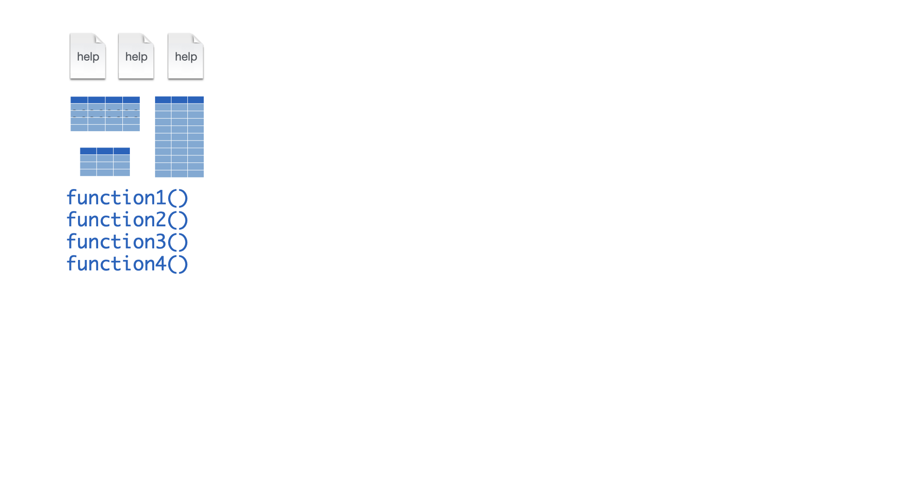
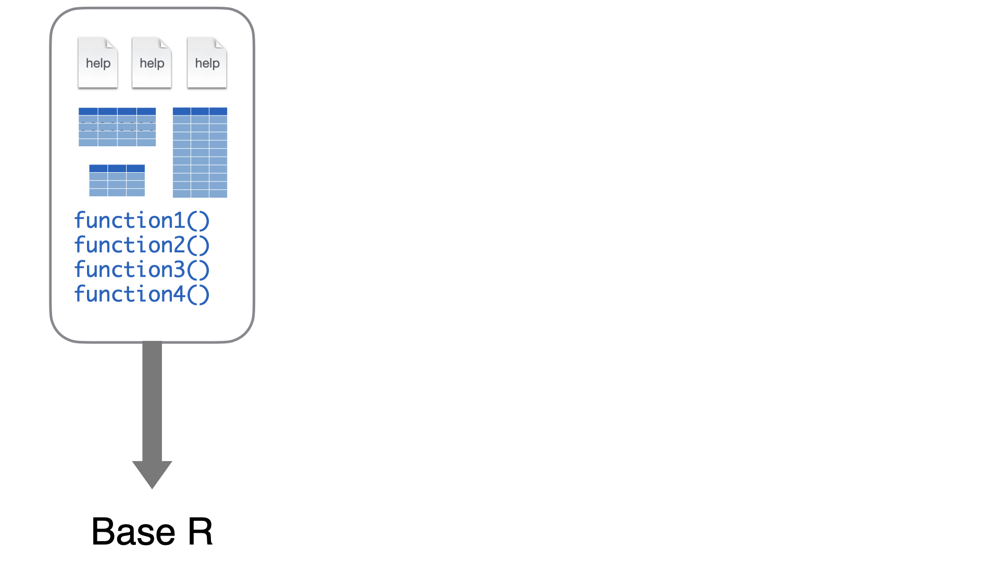
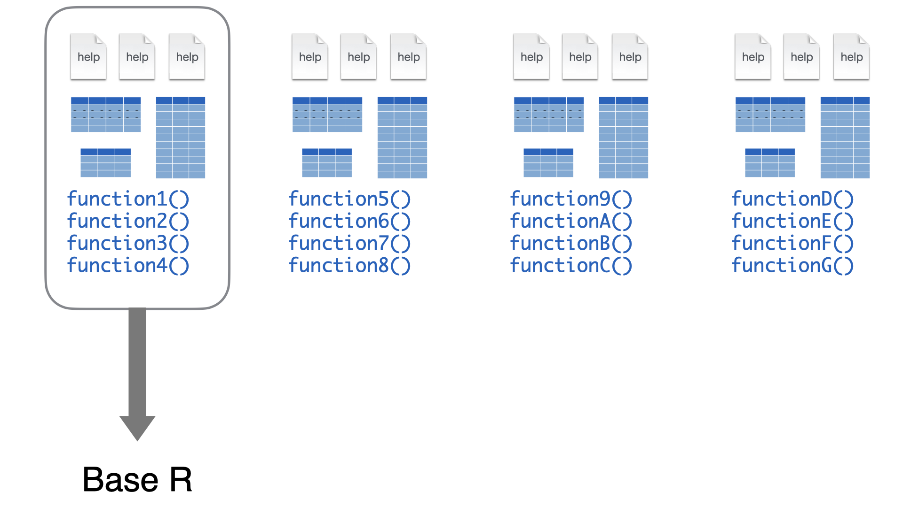
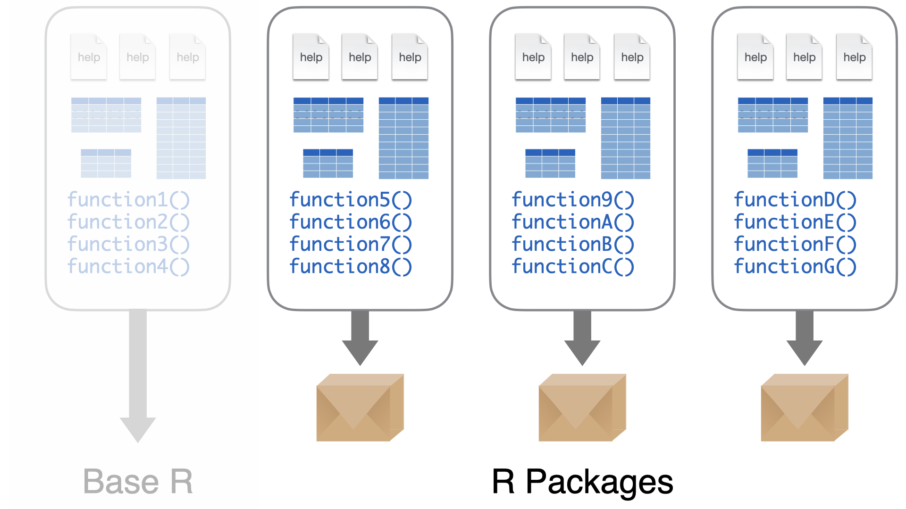
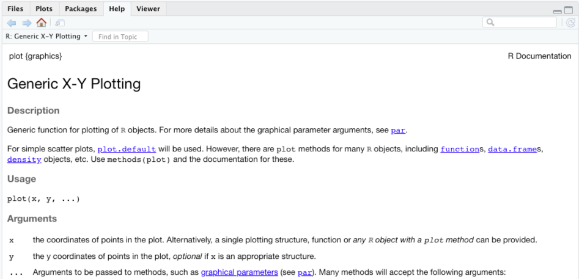

class: inverse, middle, center

# Pacotes

```{r setup, include=FALSE}
knitr::opts_chunk$set(echo = FALSE)
```

---

```{r}

```

.footnote[
-- Garrett Grolemund, [Master the Tidyverse](https://github.com/rstudio-education/master-the-tidyverse-instructors)
]

---

```{r}

```

.footnote[
-- Garrett Grolemund, [Master the Tidyverse](https://github.com/rstudio-education/master-the-tidyverse-instructors)
]

---

```{r}

```

.footnote[
-- Garrett Grolemund, [Master the Tidyverse](https://github.com/rstudio-education/master-the-tidyverse-instructors)
]

---

```{r}

```


[The Comprehensive R Archive Network (CRAN)](https://cran.r-project.org/web/packages/index.html)

.footnote[
-- Garrett Grolemund, [Master the Tidyverse](https://github.com/rstudio-education/master-the-tidyverse-instructors)
]

---
# Usando pacotes

```r
install.packages("foo")
```

* Download do código fonte do pacote para o seu computador
  * 1 x por computador

```r
library("foo")
```

* Ativa o pacote para utilização
  * 1 x por sessão 

.footnote[
-- Garrett Grolemund, [Master the Tidyverse](https://github.com/rstudio-education/master-the-tidyverse-instructors)
]

---
class: inverse, middle, center

# Obtendo ajuda

---
# Principais fontes

* Documentação
* Google
* Terceiros

---
# Documentação

```r
?plot
?source

?`<-`
?`*`
?`:`

help("<-")
help("plot")
```

```{r, out.width='75%'}

```

---

.center[
```{r, out.width='75%'}
knitr::include_graphics("https://raw.githubusercontent.com/thepracticaldev/orly-full-res/master/googlingtheerrormessage-big.png")
```
]

---
# Principais fontes

* [Stack Overflow](https://stackoverflow.com/) (e [Stack Exchange](https://stackexchange.com/))
* [RStudio Community](https://community.rstudio.com/)
* [GitHub](https://github.com/)

---
# Expressões de busca

* Inglês é língua franca
* Remova os elementos específicos da sua situação

---
# Terceiros

* Meu objetivo com esses slides é apresentar algumas estratégias que vão facilitar o oferecimento de auxílio por mim, pelos seus colegas e pela comunidade!

* No entanto, articular um problema é difícil! __Nunca deixe de perguntar__.

---
# O que deu errado?

.pull-left[
```{r}
knitr::include_graphics("assets/img/pudim.gif")
```
]
.pull-right[
> Socorro! Meu pudim deu errado!

vs

> Socorro! Meu pudim deu errado!
> 
> Eu segui essa receita.
]

.footnote[
-- Andrew Heiss (@andrewheiss), [Twitter](https://twitter.com/andrewheiss/status/1264636725617479680?s=20)
]

---
# Fazendo perguntas

Antes de perguntar, procure para ter certeza que sua pergunta já não foi respondida.

1. Resuma o problema
  * Inclua detalhes sobre o seu objetivo
  * Descreva os resultados atuais e os esperados
  * Inclua mensagens de erro
2. Descreva o que você já tentou
  * Mostre o que você já tentou e o motivo que isso não resolveu seu problema. 
3. Mostre um pouco de código
  * Quando for apropriado, compartilhe uma quantidade mínima de código no qual os [outros possam usar para reproduzir o seu problema](https://stackoverflow.com/help/minimal-reproducible-example)

Faça sua pergunta de forma pública para que outros possam se beneficiar da solução.

.footnote[
Stack Overflow, [How do I ask a good question?](https://stackoverflow.com/help/how-to-ask)
]

---
# Wisdom of the Ancients

.center[
```{r}
knitr::include_graphics("https://imgs.xkcd.com/comics/wisdom_of_the_ancients.png")
```
]

.footnote[
Fonte: https://xkcd.com/979/
]

---
# Frustração

> Frustration is natural when you start programming in R, because it is such a stickler for punctuation, and even one character out of place will cause it to complain. But while you should expect to be a little frustrated, take comfort in that it’s both typical and temporary: it happens to everyone, and the only way to get over it is to keep trying.

.footnote[
Wickham, Hadley, and Garrett Grolemund. 2017. [R for Data Science](https://r4ds.had.co.nz/workflow-basics.html)
]
---
class: inverse, middle, center

# Conceitos básicos

---
class: inverse, middle, center

# mão na massa

---
class: inverse, hide-logo

# Atividade
 
Todos devem receber um convite para colaborar no repositório `hw01-intro-programacao-<github-user>`. A entrega da atividade são os commits registrados no GitHub.
 
1. Lendo a documentação da função `read.csv`, descubra como ler corretamente o arquivo `data-raw/notificacoes-covid19-mg.csv` que utiliza `;` como separador de colunas e modifique o script `hw01-introducao-programacao.R` de forma apropriada;
1. Pesquisando no google, descubra um pacote, fora do R base, que permita a leitura correta do arquivo `data-raw/notificacoes-covid19-mg.csv`;
1. Crie um novo script que faz a mesma agregação do  `hw01-introducao-programacao.R`, mas utiliza uma função do pacote pesquisado no lugar da função `read.csv` para importação dos dados;
1. Insira um comentário no script com a [URL do pacote no CRAN](https://cran.r-project.org/web/packages/dplyr/index.html);
1. Insira uma [descrição no seu commit](https://github.com/analise-viz-dados-1sem-2020/hw-rstudio-project-ana-mendesr/commit/5ba777da28d11d2becb0ceea7339268f4cb030d3#commitcomment-39487943) contando eventuais dificuldades no seu processo de busca. Insira pelo menos sua última expressão de busca pesquisada.


