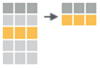
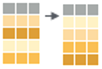
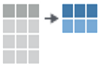

```{r setup, include=FALSE}
knitr::opts_chunk$set(echo = FALSE)
library("readr"); library("dplyr"); library("flipbookr")

df <- read_csv2("data-raw/servidoresMG_1219.csv")

ipca <- 1.002192
```

# [dplyr](https://cran.r-project.org/web/packages/dplyr/)

> dplyr: A Grammar of Data Manipulation
> 
> A fast, consistent tool for working with data frame like objects, both in memory and out of memory.

```{r, out.width='30%'}
knitr::include_graphics(path = "https://raw.githubusercontent.com/rstudio/hex-stickers/master/PNG/dplyr.png")
```

---

# Verbos essenciais

`filter(df, var == "value")`
```{r, out.width='10%'}

```

--

<hr>

`arrange(df, var)`
```{r, out.width='10%'}

```

--

<hr>

`select(df, var)`
```{r, out.width='10%'}

```

--

<hr>

`mutate(df, new_var = fun(var))`
```{r, out.width='10%'}
knitr::include_graphics("assets/img/dplyr-mutate.png")
```

--

<hr>

`summarize(df, stat = fun(var))`
```{r, out.width='10%'}

```

---
class: inverse, middle, center

# Group by

---
# Group by

.center[
```{r, out.width='70%'}
knitr::include_graphics("http://swcarpentry.github.io/r-novice-gapminder/fig/13-dplyr-fig2.png")
```
]

.footnote[
Fonte: [Software Carpentry - R for Reproducible Scientific Analysis](http://swcarpentry.github.io/r-novice-gapminder/13-dplyr/index.html)
]

---
# Group by

.center[
```{r, out.width='60%'}
knitr::include_graphics("http://swcarpentry.github.io/r-novice-gapminder/fig/13-dplyr-fig3.png")
```
]

.footnote[
Fonte: [Software Carpentry - R for Reproducible Scientific Analysis](http://swcarpentry.github.io/r-novice-gapminder/13-dplyr/index.html)
]

---
class: inverse, middle, center

# mão na massa

---
class: inverse, middle, center

# Dados relacionais 

## aka Cruzamento de dados

---
# Tipos de cruzamento

* Combinar (bind)

* Juntar (join)
    * Pesquisar (lookup)

---
class: inverse, middle, center

# mão na massa

---
class: inverse, middle, center

# Tidy data

---
# Wide vs long

.center[
```{r, out.width='25%'}
knitr::include_graphics("http://swcarpentry.github.io/r-novice-gapminder/fig/14-tidyr-fig1.png")
```
]

.footnote[
Fonte: [Software Carpentry - R for Reproducible Scientific Analysis](http://swcarpentry.github.io/r-novice-gapminder/14-tidyr/index.html)
]

---
# Pivot

.center[
```{r, out.width='100%'}
knitr::include_graphics("http://swcarpentry.github.io/r-novice-gapminder/fig/14-tidyr-fig3.png")
```
]

.footnote[
Fonte: [Software Carpentry - R for Reproducible Scientific Analysis](http://swcarpentry.github.io/r-novice-gapminder/14-tidyr/index.html)
]


---
class: inverse, middle, center

# abre parênteses

---
# Tidyverse

Conjunto de pacotes para manipulação e análise de dados que possuem uma interface de utilização similar.

Além disso

```r
library("tidyverse")
```

no lugar de

```r
library("readr"); library("tibble") # importação
library("tidyr"); library("dplyr"); library("stringr"); library("forcats") # manipulação
library("ggplot2") # visualização
library("purrr") # programação
```

.footnote[
-- [Welcome to the Tidyverse](https://www.theoj.org/joss-papers/joss.01686/10.21105.joss.01686.pdf)
]

---
class: inverse, middle, center

# fecha parênteses

---
class: inverse, middle, center

# mão na massa
